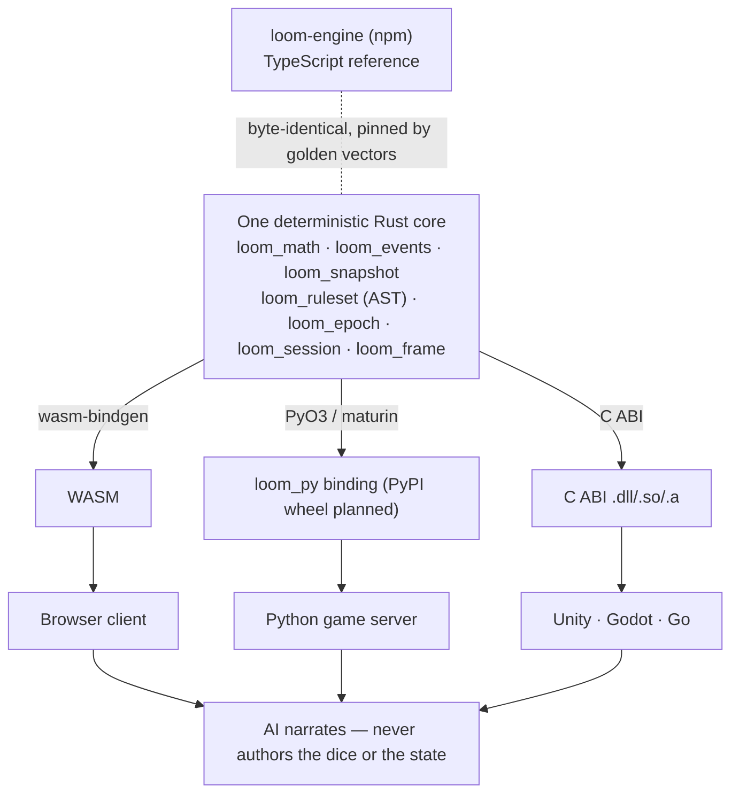

# Loom Engine

**A source-available, deterministic RPG simulation core — one Rust engine, five language
surfaces, same seed, same result.**

The engine resolves the dice and owns the state; an AI narrates the outcome but can never
author it. The same seeded simulation runs in **TypeScript (npm), Python (PyPI), Rust
(crates.io), WebAssembly, and a C ABI** and produces **byte-identical** output on every
surface — the basis for replay, server-authoritative anti-cheat primitives, and honest
AI-narrated play.

```text
same input → same 1d4 roll → same state hash, on every surface:

  tickFrame({ worldId:"arena", frameNumber:1,
    commands:[{ playerId:"p1", seq:1, actionId:"move" }], ... })

  →  x = 4
  →  state_hash = cea43ee25ad95f845260985846936bd81f2b6d1aa735102cfd001295654b0a54
```

That exact hash is reproduced by npm, the Python port, the Rust crates, the WASM build, and
the C ABI - pinned by a shared golden-vector suite (4,188 tests) and enforced in CI by the
cross-language determinism gate
([`.github/workflows/determinism-gate.yml`](.github/workflows/determinism-gate.yml)).

## Install (≈1 minute)

```bash
npm install loom-engine            # TypeScript / browser / Node
pip install loom-engine-rpg        # Python - pure-Python port (the native PyO3 wheel is not on PyPI yet; build it from rust/loom_py with maturin)
cargo add loom_frame               # Rust — the deterministic crates
```

Live playground: [theworldtable.ai/engine](https://theworldtable.ai/engine/) ·
API docs: [loom-engine.pages.dev](https://loom-engine.pages.dev/) ·
Repo: [sadhaka/loom-engine](https://github.com/sadhaka/loom-engine) ·
Reproduce the proof: [`examples/same-seed`](examples/same-seed)

## One core, five surfaces



## License

**Source-available under [BUSL-1.1](LICENSE) — *not* OSI "open source."** It is licensed
this way from day one (not relicensed after the fact), and **converts automatically to
Apache 2.0** — each version four years after its release (Change Date 2030-05-08). You may
**self-host, modify, contribute to, and build on it** for internal or non-competing
commercial use today; the single restriction protects a solo developer from a hyperscaler
turning the work into a competing hosted service before that conversion. No further
restrictions are planned, and feedback on the terms is welcome. It's the deterministic core
under a solo-founded commercial product ([TheWorldTable.ai](https://theworldtable.ai)).

## What it is — and isn't (so you don't have to guess)

- ✅ A **deterministic simulation core**: a seeded PRNG, a rules AST (d20-style
  delta / derived checks as *data*, no untrusted-code execution; broader system
  families are on the roadmap), a tamper-evident HMAC event
  chain, snapshot + replay, and a real-time command-frame + client-rollback netcode primitive.
- ✅ **Server-authoritative primitives** for anti-cheat: the engine owns the dice and the
  state, so an AI — or a client — cannot author a mechanical outcome. (Anti-cheat is a
  *system* you build on these; this is the honest referee, not a finished anti-cheat product.)
- ✅ **5e / PF2e-*style* adapters** for action economy, conditions, and grid-free range
  bands (rules-style primitives, not official D&D / Pathfinder content).
- ⚠️ Determinism is proven **byte-identical across the shared golden vectors for the
  supported APIs** — not a proof over every possible program state.
- ❌ Not a full VTT or tabletop app (no character sheets, maps, or campaign UX). It is the
  engine *underneath* one.

Shipped in production by **LoomMaster** ([theworldtable.ai/loommaster.html](https://theworldtable.ai/loommaster.html)),
an AI Dungeon Master for 5e + PF2e where every roll, degree-of-success, and HP change is
resolved server-side on a seeded PRNG and HMAC-chained for replay — the LLM only narrates.

## v3.0 - the Living Persistent World (current)

v3.0 makes the engine a deterministic, **server-authoritative world engine**. One
Rust core, bound to four surfaces, resolves the same seed to byte-identical results
everywhere - the basis for replay, anti-cheat, and honest AI narration in a shared
persistent world.

- **Any-System ruleset AST** - express d20-style rules as DATA (a strict JSON
  interpreter; no untrusted-code execution). Roll-vs-DC -> degree -> mutations,
  integer-only expressions, floor_div toward -inf, a fail-closed validation pass.
  Today it covers d20-style delta / derived checks; broader system families are
  on the roadmap.
- **Snapshot + replay** - a pure content `state_hash` reconstructs a world from a
  verified snapshot + the events after it (provably equal to replay-from-genesis).
- **Epoch world-tick** - the world keeps moving between sessions: offline factions
  act deterministically, fail-closed, bounded (the Veil-Ceiling guard). Primitive
  shipped with unit-level golden vectors; a single end-to-end
  suspend -> offline epochs -> resume reference flow is still planned.
- **WorldSession suspend/resume** - pack a world into a verifiable bundle; on resume,
  verify the snapshot hash, replay the HMAC chain tail, reject time-travel, fast-forward.
- **Real-time multiplayer core** - server-authoritative command frames, client
  rollback reconciliation (predict, then reconcile to the authoritative frame - you
  can never forge an outcome), and region hashing (a partial-sync client verifies
  only its own region + the Merkle root). The region-hash partial sync is a shipped
  primitive with golden vectors; a reference client demo that consumes it is planned.

**Every surface, one core.** A Rust workspace (`loom_math` / `loom_events` /
`loom_snapshot` / `loom_ruleset` / `loom_epoch` / `loom_session` / `loom_frame`) binds
to **WASM** (browser), a native **PyO3** binding (Python server; built from source with
maturin - the wheel is not yet published to PyPI), and a panic-guarded
**C ABI** (Unity / Godot / Go) - each verified against the same golden vectors as the
TypeScript reference.

## v2.3.0 - deterministic TTRPG core, every language

The 2.3.0 milestone extracts the deterministic tabletop primitives into a
**cross-language core**: the same rules resolve byte-identically in TypeScript,
Python, and Rust, so a server-authoritative result and a browser one can never
disagree - the basis for replay, anti-cheat, and honest AI narration.

New rules modules: grid-free **range bands** (Engaged / Near / Far), the
per-round **reaction economy** ceiling, the **narration contract**
(`findInventedNumber` - reject prose that states a mechanics number the engine
never produced, numerals **and** number-words), and **ruleset adapters** for
D&D 5e + Pathfinder 2e (action economy, initiative with a numeric-aware
tiebreak, conditions). SRD 5.1 (CC-BY-4.0) + PF2e Remaster (ORC) attributed in
`NOTICE.md`.

**One core, every surface.** A Rust deterministic core (`loom_math` PCG32 +
integer math, `loom_combat`, `loom_events` HMAC chain) binds to:

- **WASM** (wasm-bindgen) - for TS / browser / edge,
- a **native Python** extension (PyO3),
- a **C ABI** (cbindgen) - for C#/Unity, Godot/GDExtension, and Go/cgo.

A pure-Python port ships alongside: **`pip install loom-engine-rpg`** then
`import loom_engine` (the bare `loom-engine` name is taken on PyPI). Cross-language
**byte-parity is enforced** by a shared golden-vector suite that the TypeScript,
Python, and Rust test harnesses all assert against. 4131 / 4131 TS tests pass;
the release was hardened by a full external security + cross-language determinism
audit. **2.3.0 is the current npm `latest`** (`npm install loom-engine`).

## v2.2.x - EventChain integrity layer

The 2.2.x line adds **EventChain**, a tamper-evident HMAC-SHA-256-chained
event log - the integrity-bearing sibling of EventLog. Every record is
signed and folds in the previous record's signature, so the chain catches
field tampering, record deletion, reordering, and (with `seal()`) tail
truncation. Use it for audit trails, anti-cheat event tapes, and economy
/ ledger logs. Four independent security-audit rounds hardened the
canonical encoding (length-prefixed + domain-tagged, fail-closed
canonicalization, deep-clone isolation + bounded recursion + transactional
snapshot at every trust boundary); the round-4 audit is GREEN with no
CRITICAL/HIGH/MED findings. 4087 / 4087 tests passed at 2.2.5.

## v2.0.0 - Trinity Mainframe complete

The 2.0.0 drop closes the Trinity Mainframe ingestion - 14 new
pure-logic kernels that extend the Canvas2D / ECS base with
deterministic core primitives for persistent-world and multiplayer
systems. These are standalone modules, not an integrated MMORPG
runtime - there is no zone streaming, instancing, or sharding
layer. Each kernel is the safe single-thread / single-owner core
intended to drive a deferred WebGPU / WebTransport / WebCrypto /
WASM-SIMD / SQLite-WAL integration layer. All Codex hardening gates enforced inline; all
non-negotiable engine gates (no RNG, no wall clock, no Atomics,
fixed-capacity, every input bounds-checked) honoured across the
board. 3984 tests pass; see [CHANGELOG.md](./CHANGELOG.md) for the
per-component breakdown.

New components: SonicSync, LoomVerify, NeuralMaterial,
InferenceOrchestrator, LoomPulse, LoomFlow, NeuralAnimationSystem,
VoxelComputeSystem, AetherGrid, LoomFSR, SealedAssetRegistry,
LoomForgeBridge, GlobalStateLedger, LoomStudioOrchestrator.

## Install

```sh
npm install loom-engine
```

Pre-alpha. ESM-only, browser-first. TypeScript types ship in the
package (`dist/index.d.ts`). Node 18+ for the build toolchain;
the runtime targets evergreen browsers (Canvas2D + Web Audio +
EventSource).

## Documentation

API reference (TypeDoc) - generated from the public surface in
[`src/index.ts`](./src/index.ts) on every push to `main`:
**https://loom-engine.pages.dev/**

Build it locally with `npm run docs` (writes to `./docs/`).

See [Docs deploy](#docs-deploy) for the hosting chain and one-time
activation steps (Cloudflare Pages, since GitHub Pages is unavailable
on private repos for free user plans).

## Quickstart

```ts
// 1. Install
//    npm install loom-engine
import {
  Engine,
  SpriteRenderSystem,
  InputSystem,
  VeilBudgetSystem,
  SYSTEM_PHASE_INPUT,
  SYSTEM_PHASE_RENDER,
} from 'loom-engine';

// 2. Attach to a canvas. Engine.create wires Canvas2DDevice, World,
//    TransformPool, SpritePool, Time + Camera resources, and the
//    default SpriteRenderSystem in SYSTEM_PHASE_RENDER.
var canvas = document.querySelector('canvas');
var engine = Engine.create({ canvas: canvas });

// 3. Register the systems your game needs. Order within a phase is
//    deterministic; phases run INPUT -> LOGIC -> PHYSICS -> ANIMATION
//    -> RENDER -> POST_RENDER per frame.
engine.world.addSystem(new InputSystem(), SYSTEM_PHASE_INPUT);
engine.world.addSystem(new VeilBudgetSystem(), SYSTEM_PHASE_INPUT);

// 4. Drive the frame loop. engine.tick advances Time, beginFrame on
//    the device, world.update across all phases, endFrame.
function tick(now) {
  engine.tick(now);
  requestAnimationFrame(tick);
}
requestAnimationFrame(tick);
```

## Configuration

### Director-bridge credentials (security note)

`SSEDirectorBridge` and `SnapshotRecoveryHelper` send credentials with
their network requests by default. The default `eventSourceFactory`
constructs `new EventSource(url, { withCredentials: true })` and
`SnapshotRecoveryHelper` calls `fetch(url, { credentials: 'include' })`.
This is the right default for the embedded TheWorldTable.ai
same-origin use case (cookies + auth headers flow with the request
to the same origin), but **a third-party consumer pointing the bridge
at a URL configured from user input could end up sending their own
site's credentials cross-origin** (the browser still requires the
target server to opt in via `Access-Control-Allow-Credentials: true`
plus a specific `Access-Control-Allow-Origin`, so this is not a
one-sided SSRF; it requires attacker control of the target server's
CORS policy).

If you do not want credentials to flow with director-bridge requests,
override the seams the engine already exposes - no engine code change
needed:

```ts
import {
  SSEDirectorBridge,
  SnapshotRecoveryHelper,
} from 'loom-engine';

// Credential-free SSE subscription.
var bridge = new SSEDirectorBridge({
  baseUrl: directorUrl,
  characterId: characterId,
  eventSourceFactory: function(u) {
    return new EventSource(u, { withCredentials: false });
  },
});

// Credential-free snapshot recovery.
var recovery = new SnapshotRecoveryHelper({
  baseUrl: snapshotUrl,
  characterId: characterId,
  fetchImpl: function(input, init) {
    var safeInit = Object.assign({}, init, { credentials: 'omit' });
    return fetch(input, safeInit);
  },
});
```

The override hooks have always existed; 0.10.1 documents them.
Internal security audit references are kept in the repository, not
shipped with the npm package.

## Status

**Pre-alpha, productized as of 0.10.0** (Phase 11B.3 - npm publish
under MIT). Phases 0 through 9.3 + 11A.2 are shipped; the engine
runs the public TheWorldTable.ai pre-alpha. Productization is a
fund-raising and distribution decision, not a stability claim - the
public API surface will evolve until 1.0.

| Phase | Status | Surface |
|---|---|---|
| 0 | shipped | scaffolding, package.json, tsconfig, PRIOR-ART log |
| 1 | shipped | Canvas2D iso renderer, camera, transform pool (SoA) |
| 2 | shipped | ECS World, system scheduler, resource registry, Engine facade, asset pipeline |
| 3 | shipped | clip-aware sprite-sheet manifests, AnimationStatePool, AnimationSystem |
| 4 | shipped | particle pool, emitter component, three-system VFX pipeline, additive blend |
| 5 | shipped | Web Audio bus mixer with VE-budget gating, unified keyboard / mouse / touch input |
| 6 | shipped | Director-bridge: SSE event-stream subscription, eventSourceFactory hook, snapshot-recovery |
| 7 | shipped | Survivor combat layer (projectile pool, hit resolution, damage application) ported onto Loom Engine |
| 8 | shipped | 2.5D ARPG hub-and-spoke per LOOM-CLASS-SYSTEM-SPEC, plaza narrator, mobile + touch input (virtual D-pad, tap-to-walk) |
| 9.1 | shipped | perf pass: alloc-churn fixes + bench harness |
| 9.3 | shipped | TypeDoc public-API site with auto-deploy |
| 11A.2 | shipped | docs hosting migrated to Cloudflare Pages |
| 11B.3 | shipped | MIT license + npm publish posture (this release) |
| 12.4 | shipped | License pivot from MIT to BUSL 1.1 with $1M revenue cap |
| 13.2 | shipped | Engine hardening: 12.6 audit lows L-08..L-12 closed |
| 14.1 | shipped | WebGL2 instanced sprite batcher |
| 15.1 | shipped | Multiplayer presence: pluggable bridge (SSE / Mock), peer pool with per-peer linear interpolation, render system (this release) |

See [LOOM-ENGINE-SPEC.md](../docker/LOOM-ENGINE-SPEC.md) Section 7
for the full phase plan with effort estimates.

## Renderer backends

Two backends ship behind the same `IGraphicsDevice` contract:

| Backend | Status | When to use |
|---|---|---|
| `canvas2d` | default, stable | Hundreds to ~2k sprites; broadest browser coverage |
| `webgl2` | 0.12.0+, opt-in | Thousands of sprites; instanced batching with atlas grouping |

Existing consumers do not need to change anything - `Engine.create({ canvas })`
keeps the Canvas2D path it has always had, with byte-for-byte
compatibility on every public API.

### Opt into WebGL2

```ts
import { Engine, WebGL2Device } from 'loom-engine';

// Importing WebGL2Device side-effect-registers the 'webgl2' backend
// factory. The string-based form then works:
var engine = Engine.create({ canvas: myCanvas, backend: 'webgl2' });
```

Or inject a pre-built device for absolute control over construction
(useful when sharing the GL context with another renderer):

```ts
import { Engine, WebGL2Device } from 'loom-engine';

var device = new WebGL2Device(myCanvas);
var engine = Engine.create({ canvas: myCanvas, device: device });
```

### How batching works

Every `drawSprite` / `drawTile` / `drawParticle` / `drawText` call
flows through `SpriteBatcher`, which accumulates per-instance data
(screen-space origin + size, atlas UV rect, RGBA tint) into a single
Float32Array. A flush triggers when the next call uses a different
atlas or blend mode, and at `endFrame`. Each flush issues exactly
one `drawArraysInstanced` for the batch.

For maximum throughput, group draws by atlas at the system level
(e.g. render all hamlet props from one atlas, all NPCs from another).
The default `SpriteRenderSystem` already sorts globally by iso depth
key; submission order within an atlas-bounded run is preserved
through the batcher.

### Tree-shake story

`engine.ts` deliberately does **not** statically import
`WebGL2Device`. A consumer that only uses Canvas2D never pulls
WebGL2-specific code into their bundle - the only way the WebGL2
path enters the dependency graph is via an explicit
`import { WebGL2Device }`, which also triggers backend registration
through a `/*#__PURE__*/`-marked side effect.

### WebGL2 limits + fallback

- WebGL2 contexts can be lost (GPU crash, long backgrounded tab,
  extension hijack). The device handles `webglcontextlost` /
  `webglcontextrestored` automatically: every atlas re-uploads from
  its cached source image; frames during the lost interval no-op.
- Browsers without WebGL2 (Safari < 15, very old Chrome/Firefox)
  throw at `WebGL2Device` construction. Wrap the upgrade in a
  feature check and fall back to Canvas2D:
  ```ts
  function pickBackend() {
    var probe = document.createElement('canvas').getContext('webgl2');
    return probe ? 'webgl2' : 'canvas2d';
  }
  var engine = Engine.create({ canvas: myCanvas, backend: pickBackend() });
  ```
- Performance characterization lands in phase 14.3 (synthetic 5k+
  sprite bench, frame-time histograms, pareto-front against
  Canvas2D). Until then, treat WebGL2 as opt-in for scale-bound
  scenes only.

## Build

```sh
npm install
npm run build         # tsc src/ -> dist/
npm run build:demo    # tsc demo/*.ts -> demo/*.js
npm run build:all     # both
npm run watch         # rebuild src on change
npm run test          # tsx tests/*.test.ts
npm run clean         # remove dist + compiled demo
```

## Run the demos

```sh
npm run build:all
python -m http.server 8765
# browse http://localhost:8765/demo/
```

`http://localhost:8765/demo/` is the gallery index. The same tree is
published to [loom-engine.pages.dev/demo/](https://loom-engine.pages.dev/demo/)
on every push to `main`.

## Examples

Three minimal, copy-paste-ready starters live under `demo/`. Each is
roughly 150 lines of TypeScript, imports from `loom-engine`
(resolved via `importmap` to the local engine bundle), and runs in
the browser without a build step on the consumer side.

- **[Survivor Mini](./demo/survivor-mini/)** - 100-line autobattler.
  Player at center auto-fires at the nearest mob; mobs spawn from
  random screen edges and pursue. Showcases ECS pools (Transform /
  Sprite / Health / Pursue / RangedAttack), `MOB_CATALOG`, projectile
  physics, system-phase ordering.
- **[Plaza Mini](./demo/plaza-mini/)** - walkable iso plaza wired to
  a mock Director bridge. WASD to walk; the narrator overlay below
  the canvas pulses every five seconds with a synthetic
  `narrator.line` event drained from `MockDirectorBridge`. Demonstrates
  iso projection, input snapshot, the bridge / event-log / DOM-overlay
  boundary.
- **[Dialogue Mini](./demo/dialogue-mini/)** - branching dialogue
  tree, no movement, no combat. Click a choice or press 1 / 2 / 3.
  Demonstrates that the same ECS / resource model that runs the action
  demos also fits a UI-only game: custom `Resource`, custom `System`
  reading both `InputSnapshot` and DOM events, DOM as the primary UI.
- **[Plaza Multiplayer](./demo/plaza-multiplayer/)** - walkable iso
  plaza with three synthetic peers wandering randomly, driven by a
  `MockMultiplayerBridge`. WASD to walk; the local player broadcasts
  position at 10 Hz and the three peers (Alice / Bob / Carol) lerp
  smoothly between presence updates. Demonstrates the pluggable
  multiplayer bridge, `PeerPool` linear interpolation, and the
  `PeerPresenceSystem` / `PeerRenderSystem` pipeline. See the
  [Multiplayer](#multiplayer) section below for the wire protocol.

The legacy reference demos (Phase 6 director, Phase 7 combat, Phase 8
ARPG slice) stay accessible from the gallery index.

Controls in the legacy director demo (`demo/director.html`):
- **Arrow keys / WASD**: pan camera
- **Click**: burst 24 particles + play SFX chirp (after first click, AudioContext unlocks)
- **Hover**: stats panel shows the iso tile under the cursor

## Multiplayer

Phase 15.1 adds a thin presence layer for showing other players in
real time on the same world. The transport is pluggable: the engine
ships an `SSEMultiplayerBridge` (server-sent events) and a
`MockMultiplayerBridge` (in-process; tests + offline demos), and the
`IMultiplayerBridge` interface is small enough to swap in WebSocket
or WebRTC without touching anything above it. No CRDT - peers carry
position only, and conflict resolution is "last write wins" at the
server. Shared state beyond position is deferred to a later phase.

### Wire protocol

The bridge layer hides this from gameplay code, but for anyone
implementing a server (or a custom transport) the contract is:

**Server -> client (SSE event types):**
- `presence.snapshot` `{ peers: [{ character_id, x, y, zone, ts_ms, name? }] }`
  emitted once on connect with the full current peer roster. The
  client treats this as authoritative and drops any peer not in the
  snapshot.
- `presence.update` `{ character_id, x, y, zone, ts_ms, name? }`
  emitted as peers move.
- `presence.depart` `{ character_id }`
  emitted when a peer disconnects.

**Client -> server (HTTP POST):**
- `POST <broadcastUrl>` `{ character_id, x, y, zone, ts_ms }`
  the engine rate-limits to **10 Hz** (`BROADCAST_HZ`); excess calls
  to `broadcastPosition()` are silently dropped and counted in
  `bridge.stats().rateLimitedDrops`. Calling once per frame is fine.

`ts_ms` is the wall clock at which the position was true. The
`PeerPool` uses it to interpolate between successive samples so peers
don't jitter at the network rate. Acceptable lag is ~150 ms (one
update interval at 10 Hz), imperceptible at walk speed.

### Setup

```ts
import {
  Engine,
  // Multiplayer
  MockMultiplayerBridge,        // or SSEMultiplayerBridge
  PeerPool,
  PeerSpritePool,
  PeerPresenceSystem,
  PeerRenderSystem,
  POOL_PEER_SPRITE,
  RESOURCE_MULTIPLAYER_BRIDGE,
  RESOURCE_PEER_POOL,
  SYSTEM_PHASE_INPUT,
  SYSTEM_PHASE_RENDER,
} from 'loom-engine';

const engine = Engine.create({ canvas });

// 1. Create a bridge. Production code uses SSEMultiplayerBridge:
//
//   const bridge = new SSEMultiplayerBridge({
//     baseUrl: '/api/v1/loom/presence/events',
//     characterId: 'me',
//     zone: 'plaza',
//   });
//
// Tests + offline dev use the in-process mock:
const bridge = new MockMultiplayerBridge();
bridge.connect();

// 2. PeerPool stores all known peers + their interpolated positions.
//    Self-filter: tell the pool which character_id is the local player
//    so it isn't rendered as a ghost when the server echoes it back.
const peerPool = new PeerPool();
peerPool.setLocalCharacterId('me');

// 3. PeerSpritePool maps character_id -> rendering hint. A default
//    atlas + frame is enough for an undifferentiated demo; setOverride()
//    lets you assign per-class sprites or cosmetic shards.
const peerSprites = new PeerSpritePool({ defaultAtlas: peerAtlas });

engine.world.resources.set(RESOURCE_MULTIPLAYER_BRIDGE, bridge);
engine.world.resources.set(RESOURCE_PEER_POOL, peerPool);
engine.world.registerPool(POOL_PEER_SPRITE, peerSprites);

// 4. Wire the systems. PeerPresenceSystem drains the bridge each
//    frame; PeerRenderSystem submits a drawSprite + name label per
//    peer at their interpolated position.
engine.world.addSystem(new PeerPresenceSystem(), SYSTEM_PHASE_INPUT);
engine.world.addSystem(new PeerRenderSystem(),   SYSTEM_PHASE_RENDER);

// 5. Inside your walk-system, call broadcastPosition() each frame.
//    The bridge enforces the 10 Hz wire rate.
bridge.broadcastPosition(playerX, playerY, 'plaza', Date.now());
```

### Swapping transports

The bridge interface is just five methods (`connect`, `disconnect`,
`status`, `pollMessages`, `broadcastPosition`, plus `stats`). To use
WebSocket or WebRTC, implement `IMultiplayerBridge` with the same
`PresenceMessage` shape (`update` / `depart` / `snapshot`); none of
the systems above the bridge change.

## Layout

```
loom-engine/
  src/
    util/               math, color, typed-arrays
    components/         transform, sprite, particle-emitter
    renderer/           graphics-device, canvas2d-device, camera, iso-projection
    animation/          animation-clip, animation-state-pool
    asset/              sprite-sheet-loader
    audio/              audio-bus
    input/              input-manager
    systems/            sprite-render, animation, particle-{simulation,emitter,render}, input, veil-budget
    vfx/                particle-pool
    entity.ts           entity allocator (32-bit handle, generation guard)
    world.ts            ECS World class
    system.ts           System interface + phase constants
    resources.ts        ResourceRegistry + Time + VeilBudget
    engine.ts           Engine facade
    index.ts            public API barrel
  demo/                 browser demo (one tile + animated knight + sparkles + click-to-burst)
  tests/                node-based smoke tests (tsx --test)
  assets/               placeholder game assets (knight walk-cycle PNG + JSON)
  tools/                helper scripts (gen-knight.py - Pillow generator)
  PRIOR-ART.md          cumulative inspirations log (clean-room defense)
  package.json          tsc + tsx as only dev deps
  tsconfig.json         ES2022 strict + noUncheckedIndexedAccess
  dist/                 tsc output (gitignored)
  node_modules/         npm install output (gitignored)
```

## Architecture quick-reference

- **ECS** over god-object scene graph - entities are 32-bit handles,
  components live in pools indexed by entity index
- **Structure-of-arrays** for hot data (TransformPool, SpritePool,
  ParticlePool, ParticleEmitterPool, AnimationStatePool) - tight
  iteration over Float32Arrays, no per-entity object allocation
- **IGraphicsDevice** abstraction with Canvas2D primary backend
  (WebGL2 reserved for Phase 2+ if profiling demands)
- **6-phase scheduler** - INPUT -> LOGIC -> PHYSICS -> ANIMATION ->
  RENDER -> POST_RENDER, deterministic registration order within each
- **VeilBudgetResource** - the patent-defensible novelty hook. Single
  resource with `particleBudget`, `audioBudget`, `shaderBudget`,
  `eventBudget`. VeilBudgetSystem propagates updates to ParticlePool,
  AudioBus, etc. Director-bridge mutates the budget; subsystems read
- **Frame loop** - `engine.tick(now)` runs in this order:
  1. compute dt (clamped to 1/30s)
  2. advance Time resource
  3. device.beginFrame
  4. world.update (walks all phases)
  5. device.endFrame

## Public API surface (Phase 5)

```ts
import {
  Engine,
  // ECS
  POOL_TRANSFORM, POOL_SPRITE, POOL_ANIMATION, POOL_PARTICLE,
  POOL_EMITTER,
  TransformPool, SpritePool, AnimationStatePool, ParticlePool,
  ParticleEmitterPool,
  SYSTEM_PHASE_INPUT, SYSTEM_PHASE_LOGIC, SYSTEM_PHASE_PHYSICS,
  SYSTEM_PHASE_ANIMATION, SYSTEM_PHASE_RENDER, SYSTEM_PHASE_POST_RENDER,
  // Default systems
  AnimationSystem, SpriteRenderSystem,
  ParticleEmitterSystem, ParticleSimulationSystem, ParticleRenderSystem,
  InputSystem, VeilBudgetSystem,
  // Resources
  RESOURCE_TIME, RESOURCE_CAMERA, RESOURCE_DEVICE,
  RESOURCE_VEIL_BUDGET, RESOURCE_INPUT, RESOURCE_AUDIO_BUS,
  // Renderer
  Canvas2DDevice, ISO_TILE_WIDTH, ISO_TILE_HEIGHT,
  // Asset
  loadSpriteSheet, computeFrameIndex,
  // Audio
  AudioBus, AUDIO_BUDGET_AMBIENT_FLOOR, AUDIO_BUDGET_ESSENTIAL_FLOOR,
  // Input
  InputManager,
  // Math + color
  vec2, vec3, rect, clamp, lerp,
  hexToRgba, rgbaToCssString,
  COLOR_KNOT_STR, COLOR_KNOT_DEX, COLOR_KNOT_INT, COLOR_KNOT_CENTER,
  // Iso
  tileToIso, worldToIso, isoToTile, isoDepthKey,
} from 'loom-engine';

const engine = Engine.create({ canvas });
engine.world.addSystem(new InputSystem(), SYSTEM_PHASE_INPUT);
engine.world.addSystem(new VeilBudgetSystem(), SYSTEM_PHASE_INPUT);
// ... game systems ...
engine.world.addSystem(new SpriteRenderSystem(), SYSTEM_PHASE_RENDER);
function tick(now: number) {
  engine.tick(now);
  requestAnimationFrame(tick);
}
requestAnimationFrame(tick);
```

## Patent strategy

The engine's defensible novelty is in the **Loom integration layer**,
not the rasterizer. Director-driven scene state, Veil Essence economy
gating render budget, knot-aware encounter generation, event-sourced
rendering. The renderer underneath uses public-domain techniques
(sprite batching, isometric projection, ECS) implemented from scratch.

See [PRIOR-ART.md](./PRIOR-ART.md) for the cumulative inspirations
log (public talks, papers, OSS architecture - took / declined per
source).

Every architectural commit names its inspirations in plain text. No
copy-paste from any external engine source. PRIOR-ART.md is the
audit trail any future productization or patent dispute would lean on.

## Test coverage

4082 / 4082 tests pass via `tsx --test`, spanning 180+ test files in
`tests/`. Core suites include:

- `smoke.test.ts` - public API barrel, version stamp
- `world.test.ts` - ECS world, system scheduling, sprite pool, sprite render, time
- `asset-loader.test.ts` - sprite-sheet manifest, frame stepper, error discriminator
- `animation.test.ts` - animation clip math, state pool, AnimationSystem end-to-end
- `vfx.test.ts` - particle pool, emitter pool, simulation, emitter system, veil budget
- `audio-input.test.ts` - audio bus + ducking, input manager, input system, budget propagation
- `director.test.ts` - SSE bridge, eventSourceFactory hook, scene-state derivation
- `combat.test.ts` - hit resolution, damage application, knockback
- `projectile.test.ts` - projectile pool, lifetime, collision
- `arpg.test.ts` - ARPG hub-and-spoke, plaza narrator, encounter scheduling
- `snapshot-recovery.test.ts` - SnapshotRecoveryHelper for Director reconnect
- `touch-input.test.ts` - virtual D-pad, tap-to-walk, multi-touch arbitration

Run via `npm test`. Each suite is fully node-based; no DOM dependency.
Browser-only paths (Canvas2DDevice rasterization, AudioContext
unlock, DOM event listeners) are exercised via the demo's preview
verification, not unit tests.

## Docs deploy

The TypeDoc site at **https://loom-engine.pages.dev/** is served by
Cloudflare Pages from the `gh-pages` branch of this repo. The chain:

1. Push to `main` triggers `.github/workflows/docs.yml`
2. Workflow runs `npm ci`, `npm test`, `npm run docs:ci`, then publishes
   `./docs-build/` to the `gh-pages` branch via `peaceiris/actions-gh-pages`
3. Cloudflare Pages watches the `gh-pages` branch and auto-deploys on
   every push, typically within 1-2 min

GitHub Pages itself is **not** used: the repo is private and free user
plans do not include Pages on private repos. The 422 error from the
Pages create API is the canonical signal: `"Your current plan does not
support GitHub Pages for this repository."`

### Re-creating the deploy from scratch

If the Cloudflare Pages project is ever deleted or the repo is forked
to a new owner, re-activate as follows:

1. Cloudflare dashboard -> **Workers & Pages** -> **Create** -> **Pages** ->
   **Connect to Git**
2. Authorize Cloudflare on the GitHub account that owns the repo
   (only the engine repo needs to be granted access)
3. Select `loom-engine`, name the project `loom-engine` (default URL
   becomes `loom-engine.pages.dev`)
4. **Production branch**: `gh-pages`
5. **Build command**: leave empty (the gh-pages branch is already a
   built static site)
6. **Build output directory**: `/` (root)
7. Save and deploy. First deploy reads whatever is currently on
   `gh-pages`; subsequent deploys auto-trigger on push to that branch
8. Optional: assign a custom domain (e.g. `engine.theworldtable.ai`)
   under the project's **Custom domains** tab. CF DNS for
   `theworldtable.ai` is already on the same account, so this is a
   one-click CNAME add

If the workflow ever stops updating `gh-pages` (CF Pages will keep
serving the last successful build but go stale), check
`gh run list --repo sadhaka/loom-engine --workflow=docs.yml`.

## License

Versions 0.11.0 and later are licensed under the
[Business Source License 1.1](./LICENSE) - SPDX identifier `BUSL-1.1`,
declared in `package.json`. Copyright (c) 2026 Misha Mitiev.

GitHub's repo header shows "Other" / "NOASSERTION" for this repo: its license
detector (licensee) only recognizes the open-source licenses catalogued on
choosealicense.com, and BUSL-1.1 is source-available, not in that set - so every
BUSL project displays this way. It is cosmetic; the authoritative license is the
LICENSE file plus the `BUSL-1.1` SPDX id in package.json.

For a one-page plain-English overview of the terms (what you can do for
free, what requires a commercial license, the Change Date conversion to
Apache 2.0), see [docs/LICENSE-HEADER.md](./docs/LICENSE-HEADER.md).

- **Free for use** below USD $1,000,000 annual gross revenue from any
  product, game, or service that incorporates this engine. Personal
  projects, learning, prototyping, and indie games well under that
  threshold all qualify.
- **Commercial license required** above the threshold. Contact
  `licensor@theworldtable.ai`. Standard terms include a 5% royalty on
  excess revenue; lump-sum buyouts and equity-for-license arrangements
  are negotiable. See
  [COMMERCIAL_LICENSE_TERMS.md](./COMMERCIAL_LICENSE_TERMS.md).
- **Auto-converts to Apache 2.0** on **2030-05-08** (4-year window per
  BUSL spec). After that date, all 0.11.0+ versions become permissive.
- **Patent strategy**: novelty claims documented in PRIOR-ART.md are
  independent of the source-code license and apply to all versions
  regardless of license phase.

Version 0.10.0 (the only previously-published release) remains
permanently licensed under MIT for backwards compatibility. Projects
pinned to `0.10.0` are unaffected by the license change but will not
receive future updates without accepting BUSL-1.1.

## Publishing

Tagged releases publish to npm via
[`.github/workflows/npm-publish.yml`](./.github/workflows/npm-publish.yml).
The workflow runs `npm test` and `npm run build`, then
`npm publish --access public`, when a tag matching `v*` is pushed to
`main`. It needs the `NPM_TOKEN` repo secret to authenticate.

Manual publish from a local checkout:

```sh
npm login                       # one-time, npm account named sadhaka
npm test                        # 208/208 must pass
npm run build                   # tsc -> dist/
npm publish --dry-run           # inspect tarball contents first
npm publish --access public     # scoped packages default to private; flag is required
```

`prepublishOnly` in `package.json` re-runs `npm test && npm run build`
before any publish, so the dry-run and the final publish always rebuild
from a clean source tree.

## Contributing

This is a single-author project (Misha Mitiev) for TheWorldTable.ai.
The BUSL-1.1 license permits forking and modification under the revenue
cap (see License above); pull requests are
welcome but not actively triaged - the canonical roadmap is the spec
file (`LOOM-ENGINE-SPEC.md` in the parent repo) and capacity is
limited. For bug reports, file an issue with a minimal repro.
